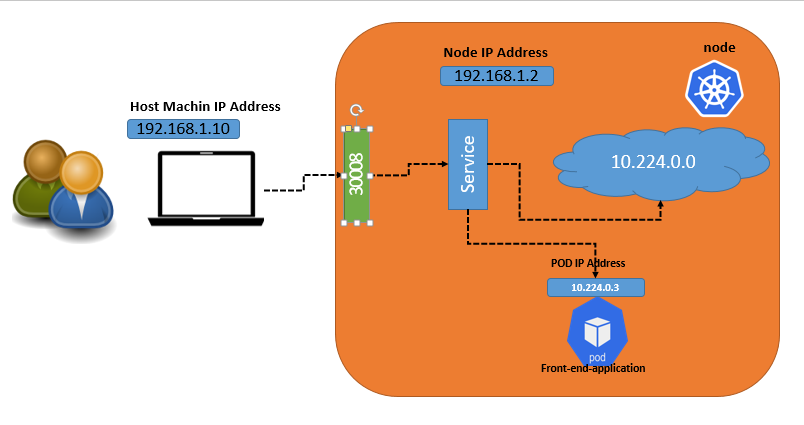
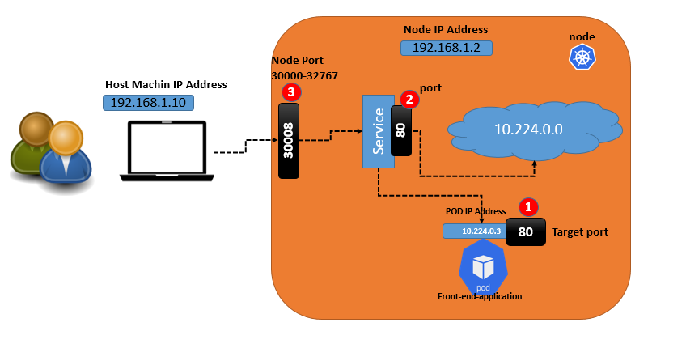

# Service

- An abstract way to expose an application running on a set of Pods as a network service.
- With Kubernetes you don't need to modify your application to use an unfamiliar service discovery mechanism. 
- Kubernetes gives Pods their own IP addresses and a single DNS name for a set of Pods, and can load-balance across them.
- Kubernetes services enables the communication between various components within and out side of application.
- Kubernetes services enables the communication between other applications and users. 

Exmaple - 
let assume we have 3 set of pods. first running the front end , second runnig the backend and third running the database. its service which enable the communication between user to font end service , front service to back end service and finally backend service to database service. 

- Kubernetes Pods are mortal. They are born and when they die, they are not resurrected. If you use a Deployment to run your app, it can create and destroy Pods dynamically.

- Each Pod gets its own IP address, however in a Deployment, the set of Pods running in one moment in time could be different from the set of Pods running that application a moment later.

- This leads to a problem: *if some set of Pods (call them "backends") provides functionality to other Pods (call them "frontends") inside your cluster, how do the frontends find out and keep track of which IP address to connect to, so that the frontend can use the backend part of the workload*

**the Answer is  Services**



```
apiVersion: v1
kind: Service
metadata:
  name: web-dashboard-service

spec:
  type: NodePort
  ports:
    - port: 80 # service port
      nodePort: 30008 # port for external access. 
      targetPort: 80 # pod port 
  selector: 
    # below labels are from pod defination.
    # this link service to the pods.   
    type: web-dashboard
```


- here in port section only mendetory value is port.
- if target port is not assigned considerd same value as port.
- if nodeport is not defined , and random port will be assigned. 


This specification creates a new Service object named "my-service", which targets TCP port 9376 on any Pod with the app=MyApp label.

**Types of Kubernetes services**

There are four types of Kubernetes services:

**NodePort**. This type of service exposes the service on each node’s IP at a static port. A ClusterIP service is created automatically, and the NodePort service will route to it. From outside the cluster, you can contact the NodePort service by using “<NodeIP>:<NodePort>”.



**ClusterIP**. This default type exposes the service on a cluster-internal IP. You can reach the service only from within the cluster.

**LoadBalancer**. This service type exposes the service externally using the load balancer of your cloud provider. The external load balancer routes to your NodePort and ClusterIP services, which are created automatically.

**ExternalName**. This type maps the service to the contents of the externalName field (e.g., foo.bar.example.com). It does this by returning a value for the CNAME record.


What is the Ingress?
The Ingress is a Kubernetes resource that lets you configure an HTTP load balancer for applications running on Kubernetes, represented by one or more Services. Such a load balancer is necessary to deliver those applications to clients outside of the Kubernetes cluster.

The Ingress resource supports the following features:

Content-based routing:
Host-based routing. For example, routing requests with the host header foo.example.com to one group of services and the host header bar.example.com to another group.
Path-based routing. For example, routing requests with the URI that starts with /serviceA to service A and requests with the URI that starts with /serviceB to service B.
TLS/SSL termination for each hostname, such as foo.example.com.
