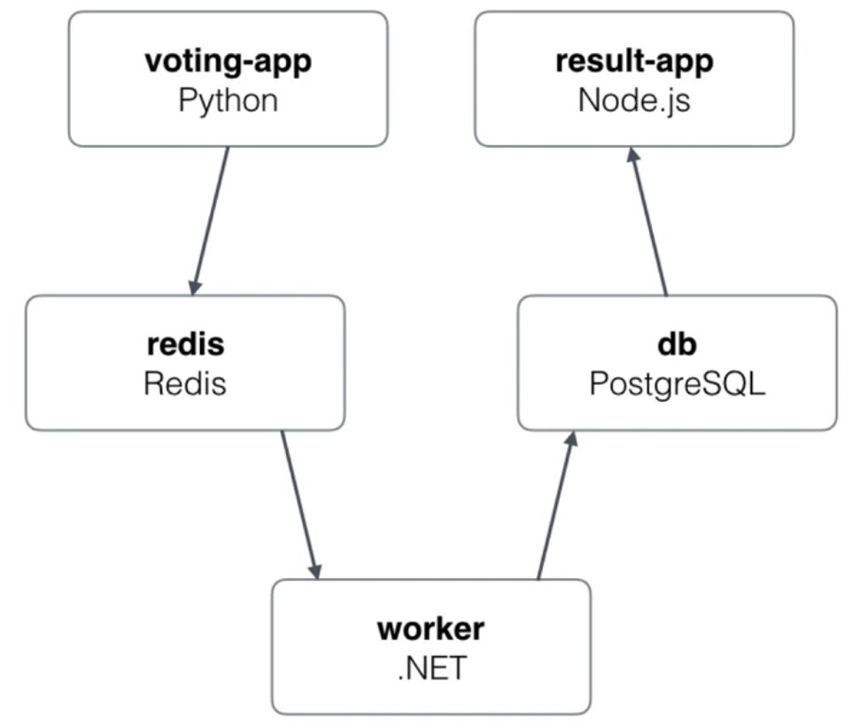
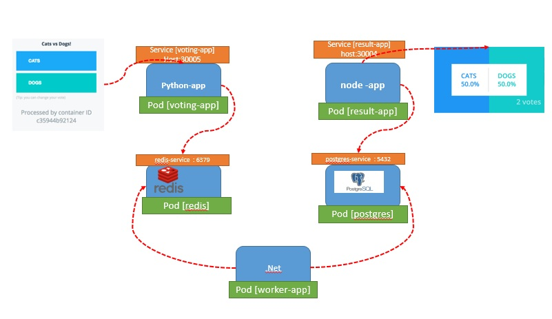
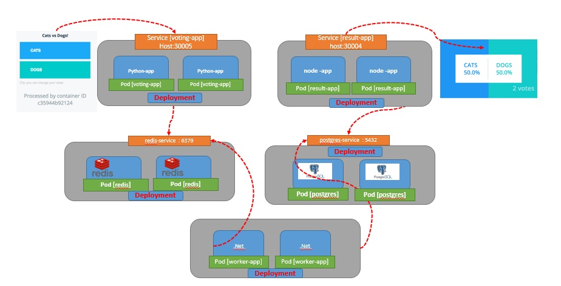

#  Demo of Cats and Dogs Voting Application. 

Here is the flow/architure of this application. 

Docker Containers for this application are used from kodekloud
- kodekloud/examplevotingapp_result:v1
- kodekloud/examplevotingapp_vote:v1
- kodekloud/examplevotingapp_worker:v1

- **via Pod-Service** 
this is how the applications will look like with pod and services

1. run create-pod-service.sh
2. this will create all the rquired pods/services for the applications stack
3. Access voting app via host:30005
4. Access result app via host:30004

Post testing run delete-pod-service.sh for cleaning up.

- **via Pod-Service** 
this is how the applications will look like with pod and services

1. run create-deployment-service.sh
2. this will create all the rquired deployment/pods/services for the application stack
3. Access voting app via host:30005
4. Access result app via host:30004

Post testing run delete-deplyment-service.sh for cleaning up.