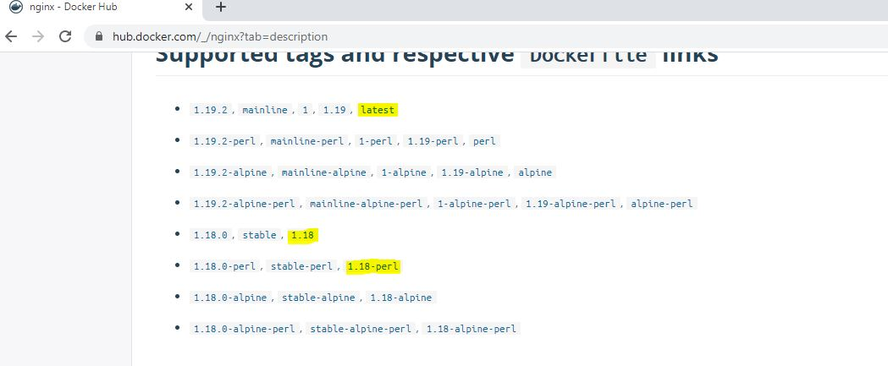

#  Update Deployment via edit Deployment Command 

- We will be updating the image section to assume a new version of application needs to be updated.
- Use docker hub to see the other official tags 

[nginx tags link](https://hub.docker.com/_/nginx?tab=description)



- **see the current Image name**
```
$ kubectl describe  deployment.apps/nginx-deployment | grep Image
    Image:        nginx
```

```
$ kubectl edit deployment nginx-deployment
```

- This command opens and vim editor to edit the deployment.
- update the image section with nginx:1.18

- **verify the new Image**

 $ kubectl describe  deployment.apps/nginx-deployment | grep Image
    Image:        nginx:1.18

- **verify the new Image**
```
$ kubectl rollout history  deployment.apps/nginx-deployment
deployment.apps/nginx-deployment
REVISION  CHANGE-CAUSE
1         kubectl create --filename=nginx-deployment.yaml --record=true
2         kubectl create --filename=nginx-deployment.yaml --record=true
```

*Here kubectl get rs [replicaset] shows the another replicaset is created *

- This will created new pods and delete the new pods 
- Due to default deployment strategy "rolling-update" all the pods won;t go down in one shot. 

```
$ kubectl get rs
NAME                          DESIRED   CURRENT   READY   AGE
nginx-deployment-7f6cd547bd   4         4         4       2m1s
nginx-deployment-d46f5678b    0         0         0       30m
```

- Verify the Image version and rolling-update in Events section.
- Annotation will have revision as 2.

```
$ kubectl describe  deployment.apps/nginx-deployment
Name:                   nginx-deployment
Namespace:              default
CreationTimestamp:      Fri, 14 Aug 2020 15:52:47 +0000
Labels:                 app=nginx
Annotations:            deployment.kubernetes.io/revision: 2
                        kubernetes.io/change-cause: kubectl create --filename=nginx-deployment.yaml --record=true
Selector:               app=nginx
Replicas:               4 desired | 4 updated | 4 total | 4 available | 0 unavailable
StrategyType:           RollingUpdate
MinReadySeconds:        0
RollingUpdateStrategy:  25% max unavailable, 25% max surge
Pod Template:
  Labels:  app=nginx
  Containers:
   nginx:
    Image:        nginx:1.18
    Port:         80/TCP
    Host Port:    0/TCP
    Environment:  <none>
    Mounts:       <none>
  Volumes:        <none>
Conditions:
  Type           Status  Reason
  ----           ------  ------
  Available      True    MinimumReplicasAvailable
  Progressing    True    NewReplicaSetAvailable
OldReplicaSets:  <none>
NewReplicaSet:   nginx-deployment-7f6cd547bd (4/4 replicas created)
Events:
  Type    Reason             Age   From                   Message
  ----    ------             ----  ----                   -------
  Normal  ScalingReplicaSet  29m   deployment-controller  Scaled up replica set nginx-deployment-d46f5678b to 4
  Normal  ScalingReplicaSet  103s  deployment-controller  Scaled up replica set nginx-deployment-7f6cd547bd to 1
  Normal  ScalingReplicaSet  103s  deployment-controller  Scaled down replica set nginx-deployment-d46f5678b to 3
  Normal  ScalingReplicaSet  103s  deployment-controller  Scaled up replica set nginx-deployment-7f6cd547bd to 2
  Normal  ScalingReplicaSet  95s   deployment-controller  Scaled down replica set nginx-deployment-d46f5678b to 2
  Normal  ScalingReplicaSet  95s   deployment-controller  Scaled up replica set nginx-deployment-7f6cd547bd to 3
  Normal  ScalingReplicaSet  94s   deployment-controller  Scaled down replica set nginx-deployment-d46f5678b to 1
  Normal  ScalingReplicaSet  94s   deployment-controller  Scaled up replica set nginx-deployment-7f6cd547bd to 4
  Normal  ScalingReplicaSet  91s   deployment-controller  Scaled down replica set nginx-deployment-d46f5678b to 0
```