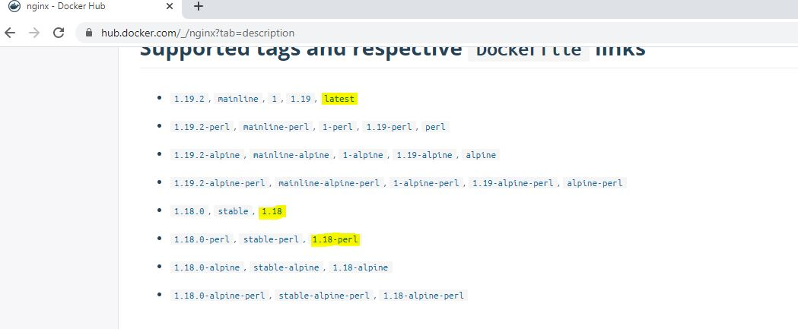

#  Update Deployment via set Image Command 

- We will be updating the image via set command  assume a new version of application needs to be updated.
- Use docker hub to see the other official tags 

[nginx tags link](https://hub.docker.com/_/nginx?tab=description)



**Pre rwq**

- Use nginx-deployment.yaml  to create a new deployment.

**Create a Deployment**
```
$ kubectl create -f nginx-deployment.yaml
deployment.apps/nginx-deployment created
```

**List Objects created with deployment**

```
$ kubectl get all
NAME                                   READY   STATUS    RESTARTS   AGE
pod/nginx-deployment-d46f5678b-76nns   1/1     Running   0          19s
pod/nginx-deployment-d46f5678b-gxksk   1/1     Running   0          19s
pod/nginx-deployment-d46f5678b-kfq7q   1/1     Running   0          19s
pod/nginx-deployment-d46f5678b-r9dq7   1/1     Running   0          19s

NAME                 TYPE        CLUSTER-IP   EXTERNAL-IP   PORT(S)   AGE
service/kubernetes   ClusterIP   10.96.0.1    <none>        443/TCP   31m

NAME                               READY   UP-TO-DATE   AVAILABLE   AGE
deployment.apps/nginx-deployment   4/4     4            4           19s

NAME                                         DESIRED   CURRENT   READY   AGE
replicaset.apps/nginx-deployment-d46f5678b   4         4         4       19s

```

- **see the current Image name**
```
$ kubectl describe  deployment.apps/nginx-deployment | grep Image
    Image:        nginx
```

- **kubectl set Command**
```
$ kubectl set --help
Configure application resources

 These commands help you make changes to existing application resources.

Available Commands:
  env            Update environment variables on a pod template
  image          Update image of a pod template
  resources      Update resource requests/limits on objects with pod templates
  selector       Set the selector on a resource
  serviceaccount Update ServiceAccount of a resource
  subject        Update User, Group or ServiceAccount in a RoleBinding/ClusterRoleBinding

Usage:
  kubectl set SUBCOMMAND [options]
```

- **kubectl set image command**
- set image can be applied over pod (po), replicationcontroller (rc), deployment (deploy), daemonset (ds), replicaset (rs)

```
$ kubectl set image --help
Update existing container image(s) of resources.

 Possible resources include (case insensitive):

  pod (po), replicationcontroller (rc), deployment (deploy), daemonset (ds), replicaset (rs)

Examples:
  # Set a deployment's nginx container image to 'nginx:1.9.1', and its busybox container image to 'busybox'.
  kubectl set image deployment/nginx busybox=busybox nginx=nginx:1.9.1

  # Update all deployments' and rc's nginx container's image to 'nginx:1.9.1'
  kubectl set image deployments,rc nginx=nginx:1.9.1 --all

  # Update image of all containers of daemonset abc to 'nginx:1.9.1'
  kubectl set image daemonset abc *=nginx:1.9.1

  # Print result (in yaml format) of updating nginx container image from local file, without hitting the server
  kubectl set image -f path/to/file.yaml nginx=nginx:1.9.1 --local -o yaml

```  

- **Let's update the nginx image to nginx:1.18**
- kubectl set image deployment **DEPLOYMENT_NAME** **CONTAINER_NAME**=**IMAGE_NAME:version** --record

```
$ kubectl set image deployment nginx-deployment nginx=nginx:1.18 --record
deployment.apps/nginx-deployment image updated

```

- **Check the history**

$ kubectl rollout history deployment/nginx-deployment
deployment.apps/nginx-deployment
REVISION  CHANGE-CAUSE
1         <none>
2         kubectl set image deployment nginx-deployment nginx=nginx:1.18 --record=true

- **Check the deployment**
```
$ kubectl describe  deployment.apps/nginx-deployment | grep Image
    Image:        nginx:1.18
```

- **Validate Events**
```
$ kubectl describe  deployment.apps/nginx-deployment
Name:                   nginx-deployment
Namespace:              default
CreationTimestamp:      Fri, 14 Aug 2020 17:22:22 +0000
Labels:                 app=nginx
Annotations:            deployment.kubernetes.io/revision: 2
                        kubernetes.io/change-cause: kubectl set image deployment nginx-deployment nginx=nginx:1.18 --record=true
Selector:               app=nginx
Replicas:               4 desired | 4 updated | 4 total | 4 available | 0 unavailable
StrategyType:           RollingUpdate
MinReadySeconds:        0
RollingUpdateStrategy:  25% max unavailable, 25% max surge
Pod Template:
  Labels:  app=nginx
  Containers:
   nginx:
    Image:        nginx:1.18
    Port:         80/TCP
    Host Port:    0/TCP
    Environment:  <none>
    Mounts:       <none>
  Volumes:        <none>
Conditions:
  Type           Status  Reason
  ----           ------  ------
  Available      True    MinimumReplicasAvailable
  Progressing    True    NewReplicaSetAvailable
OldReplicaSets:  <none>
NewReplicaSet:   nginx-deployment-7f6cd547bd (4/4 replicas created)
Events:
  Type    Reason             Age    From                   Message
  ----    ------             ----   ----                   -------
  Normal  ScalingReplicaSet  12m    deployment-controller  Scaled up replica set nginx-deployment-d46f5678b to 4
  Normal  ScalingReplicaSet  4m6s   deployment-controller  Scaled up replica set nginx-deployment-7f6cd547bd to 1
  Normal  ScalingReplicaSet  4m6s   deployment-controller  Scaled down replica set nginx-deployment-d46f5678b to 3
  Normal  ScalingReplicaSet  4m6s   deployment-controller  Scaled up replica set nginx-deployment-7f6cd547bd to 2
  Normal  ScalingReplicaSet  3m59s  deployment-controller  Scaled down replica set nginx-deployment-d46f5678b to 2
  Normal  ScalingReplicaSet  3m58s  deployment-controller  Scaled up replica set nginx-deployment-7f6cd547bd to 3
  Normal  ScalingReplicaSet  3m57s  deployment-controller  Scaled down replica set nginx-deployment-d46f5678b to 1
  Normal  ScalingReplicaSet  3m57s  deployment-controller  Scaled up replica set nginx-deployment-7f6cd547bd to 4
  Normal  ScalingReplicaSet  3m55s  deployment-controller  Scaled down replica set nginx-deployment-d46f5678b to 0
```  

- **let's change the image version one more time**
```
$ kubectl set image deployment nginx-deployment nginx=nginx:1.18-alpine --record
deployment.apps/nginx-deployment image updated
```

- **Validate the History**
```
$ kubectl rollout history deployment/nginx-deployment
deployment.apps/nginx-deployment
REVISION  CHANGE-CAUSE
1         <none>
2         kubectl set image deployment nginx-deployment nginx=nginx:1.18 --record=true
3         kubectl set image deployment nginx-deployment nginx=nginx:1.18-alpine --record=true
```

