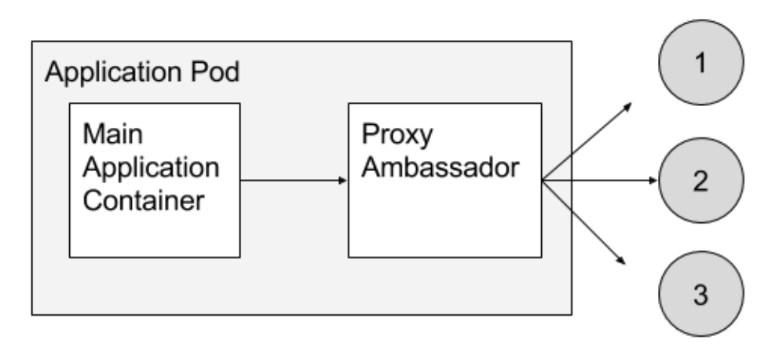

## Multi Cotainer POD

- The primary reason that Pods can have multiple containers is to support helper applications that assist a primary application.
- Typical examples of helper applications are data pullers, data pushers, and proxies. 
- Helper and primary applications often need to communicate with each other. 
- Typically this is done through a shared filesystem.  
- An example of this pattern is a web server along with a helper program that polls a Git repository for new updates.

**1: Sidecar containers**

- Sidecar containers extend and enhance the "main" container, they take existing containers and make them better.  

- For example, a web server container (a primary application) that needs to have its logs parsed and forwarded to log storage (a secondary task) may use a sidecar container that takes care of the log forwarding. 

**2: Ambassador containers**

- Ambassador containers proxy a local connection to the world.  
    - As an example, consider a Redis cluster with read-replicas and a single write master.  You can create a Pod that groups your main application with a Redis ambassador container.  
    - The ambassador is a proxy is responsible for splitting reads and writes and sending them on to the appropriate servers.  
    - Because these two containers share a network namespace, they share an IP address and your application can open a connection on “localhost” and find the proxy without any service discovery.

**2: Adapter containers**
- The adapter container pattern generally transforms the output of the primary container into the output that fits the standards across your applications.

    - For example, an adapter container could expose a standardized monitoring interface to your application even though the application does not implement it in a standard way. 
    - The adapter container takes care of converting the output into what is acceptable at the cluster level.

