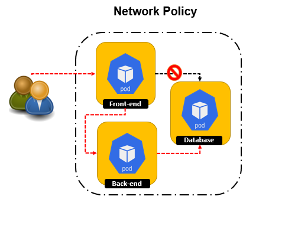
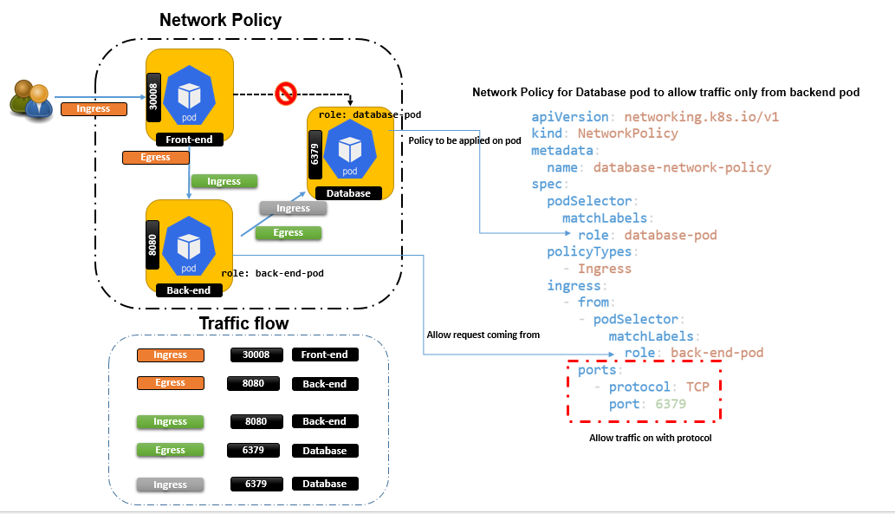

# Network Policies – The Theory

- In a default deployment of a Kubernetes cluster, all of the pods deployed on the nodes can communicate with each other.
- ways to limit the communications between pods and they’re called network policies.
- Kubernetes Network Policy is not a firewall, but it does restrict the traffic between pods so that they can’t all communicate with each other.


As we know that all of the pods deployed on the nodes can communicate with each other. idea behind the restricting pods to communicate to each other to ensure that only intended pods can communicate to each other.



like in above exmaple we have a front-end pod , back-endpod and db pod. for better security only backend pod should have access to db-pod and front end pod should not be allowed to access the db-pod.

Inorder to apply such restrictions on the pods Network Policy objects can be created. 




Sample Network policy for database pod
```
apiVersion: networking.k8s.io/v1
kind: NetworkPolicy
metadata:
  name: database-network-policy
spec:
  podSelector:  # Network policy wiil be applied on pod matching lables. 
    matchLabels:
      role: database-pod
  policyTypes:
    - Ingress
  ingress:
    - from:
      - podSelector: # traffic allowed from pod mathing labels.
          matchLabels:
            role: back-end-pod
      ports:
        - protocol: TCP 
          port: 6379
```


Sample Network policy for backend server with both ingress and egress 

```
apiVersion: networking.k8s.io/v1
kind: NetworkPolicy
metadata:
  name: backend-pod-network-policy
spec:
  podSelector:
    matchLabels:
      role: back-end-pod
  egress:
    - to: 
       - podSelector:
           matchLabels:
              role: database-pod
      ports:
        - port : 6379
  ingress:
    - from:
      - podSelector:
          matchLabels:
              role: fornt-end
      ports:
        - port : 8080
```