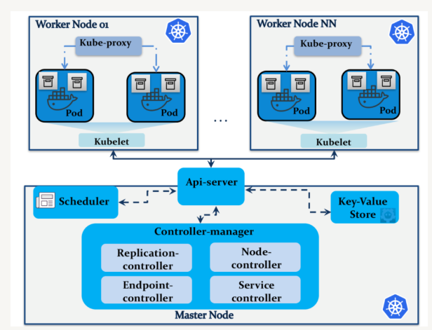

## POD  ##

Pods
- Pods are the smallest deployable units of computing that you can create and manage in Kubernetes.
-  A Pod models an application-specific "logical host": it contains one or more application containers which are relatively tightly coupled.


Pods in a Kubernetes cluster are used in two main ways:

- **Pods that run a single container**. The "one-container-per-Pod" model is the most common Kubernetes use case; in this case, you can think of a Pod as a wrapper around a single container; Kubernetes manages Pods rather than managing the containers directly.

- **Pods that run multiple containers** that need to work together. A Pod can encapsulate an application composed of multiple co-located containers that are tightly coupled and need to share resources. 
    
    


- **Master node:** This controls and orchestrates the Kubernetes cluster. A master node can run the subsequent services:
- **API-server:** This provides API endpoints to process RESTful API calls to regulate and manage the cluster
- **Controller manager:** This embeds several management services including
- **Replication controller:** This manages pods within the cluster by creating and removing failed pods.
- **Endpoint controller:** It joins pods by providing cluster endpoints.
- **Node controller:** This manages node initialization and discovery information within the cloud provider.
- **Service controller:** This maintains service backends in Kubernetes running behind load balancers. The service controller configures    loadbalancers supported the service state update.
- **Scheduler:** This decides the pod on which the service deployment should happen. supported the node resource capacity, the scheduler makes sure that the specified service would run onto the nodes belonging to an equivalent pod or across different ones.
- **Key-value store:** This stores REST API objects like node and pod states, scheduled jobs, service deployment information, and namespaces. Kubernetes utilizes etcd as its main key-value store to share configuration information across the cluster.
- **Worker node:** It handles the Kubernetes pods and containers runtime environment. Each worker node runs the subsequent components:
- **Kubelet:** This is often a primary node agent that takes care of containers running in their associated pods. The kubelet process reports the health status of pods and nodes to the master node periodically.
- **Docker:** This is often the default container runtime engine employed by Kubernetes.
- **Kube-proxy:** This is often a network proxy to forward requests to the proper container. Kube-proxy routes traffic across pods within an equivalent service.


## Create POD [Create POD via kubctl Command line] ##

- Verify no other pod is running 
```
$ kubectl get pods
No resources found in default namespace.
```

- Create a simple new pod with name "run-web-server" with nginx image
```
$ kubectl run run-web-server --image=nginx
pod/run-web-server created
```

- list the pod [Status Pending]
```
$ kubectl get pods
NAME             READY   STATUS    RESTARTS   AGE
run-web-server   0/1     Pending   0          5s
```

- list the pod [Status ContainerCreating]
```
$ kubectl get pods
NAME             READY   STATUS              RESTARTS   AGE
run-web-server   0/1     ContainerCreating   0          20s
```

- list the pod [Status running]
```
$ kubectl get pods
NAME             READY   STATUS    RESTARTS   AGE
run-web-server   1/1     Running   0          27s
```

## Create POD [Create POD via Pod spec yaml] ##

Sample pod yaml
```
apiVersion: v1
kind: Pod ## kind as POD
metadata:
  name: nginx-pod ## Name of pod
  labels:
    app: nginx-pod ## lables for pod
spec:
  containers:
    - name: test-container ## container name
      image: nginx  ## image 

```
- Create a new pod
```
$ kubectl create -f basic-pod.yaml
pod/nginx-pod created
```

- list the pods 
```
$ kubectl get pods
NAME        READY   STATUS    RESTARTS   AGE
nginx-pod   1/1     Running   0          31s
```

- describe the nginx-pods , this give all the details about the pod. 
```
master $ kubectl describe pod nginx-pod
Name:         nginx-pod
Namespace:    default
Priority:     0
Node:         node01/172.17.0.19
Start Time:   Wed, 19 Aug 2020 15:35:16 +0000
Labels:       app=nginx-pod
Annotations:  <none>
Status:       Running
IP:           10.244.1.3
IPs:
  IP:  10.244.1.3
Containers:
  test-container:
    Container ID:   docker://f0710aa255c58c12060d94d4297bc822b846481859e159e40f81c919ff17c7ed
    Image:          nginx
    Image ID:       docker-pullable://nginx@sha256:b0ad43f7ee5edbc0effbc14645ae7055e21bc1973aee5150745632a24a752661
    Port:           <none>
    Host Port:      <none>
    State:          Running
      Started:      Wed, 19 Aug 2020 15:35:30 +0000
    Ready:          True
    Restart Count:  0
    Environment:    <none>
    Mounts:
      /var/run/secrets/kubernetes.io/serviceaccount from default-token-qtcmd (ro)
Conditions:
  Type              Status
  Initialized       True
  Ready             True
  ContainersReady   True
  PodScheduled      True
Volumes:
  default-token-qtcmd:
    Type:        Secret (a volume populated by a Secret)
    SecretName:  default-token-qtcmd
    Optional:    false
QoS Class:       BestEffort
Node-Selectors:  <none>
Tolerations:     node.kubernetes.io/not-ready:NoExecute for 300s
                 node.kubernetes.io/unreachable:NoExecute for 300s
Events:
  Type    Reason     Age   From               Message
  ----    ------     ----  ----               -------
  Normal  Scheduled  111s  default-scheduler  Successfully assigned default/nginx-pod to node01
  Normal  Pulling    109s  kubelet, node01    Pulling image "nginx"
  Normal  Pulled     99s   kubelet, node01    Successfully pulled image "nginx"
  Normal  Created    97s   kubelet, node01    Created container test-container
  Normal  Started    97s   kubelet, node01    Started container test-container
```

- use get pod command to see the yaml spec for the pod with -o flag
```
$ kubectl get pods nginx-pod -o yaml
apiVersion: v1
kind: Pod
metadata:
  creationTimestamp: "2020-08-19T15:35:16Z"
  labels:
    app: nginx-pod
    type: web-server
  managedFields:
  - apiVersion: v1
    fieldsType: FieldsV1
    fieldsV1:
      f:status:
        f:conditions:
          k:{"type":"ContainersReady"}:
            .: {}
            f:lastProbeTime: {}
            f:lastTransitionTime: {}
            f:status: {}
            f:type: {}
          k:{"type":"Initialized"}:
            .: {}
            f:lastProbeTime: {}
            f:lastTransitionTime: {}
            f:status: {}
            f:type: {}
          k:{"type":"Ready"}:
            .: {}
            f:lastProbeTime: {}
            f:lastTransitionTime: {}
            f:status: {}
            f:type: {}
        f:containerStatuses: {}
        f:hostIP: {}
        f:phase: {}
        f:podIP: {}
        f:podIPs:
          .: {}
          k:{"ip":"10.244.1.3"}:
            .: {}
            f:ip: {}
        f:startTime: {}
    manager: kubelet
    operation: Update
    time: "2020-08-19T15:35:31Z"
  - apiVersion: v1
    fieldsType: FieldsV1
    fieldsV1:
      f:metadata:
        f:labels:
          .: {}
          f:app: {}
          f:type: {}
      f:spec:
        f:containers:
          k:{"name":"test-container"}:
            .: {}
            f:image: {}
            f:imagePullPolicy: {}
            f:name: {}
            f:resources: {}
            f:terminationMessagePath: {}
            f:terminationMessagePolicy: {}
        f:dnsPolicy: {}
        f:enableServiceLinks: {}
        f:restartPolicy: {}
        f:schedulerName: {}
        f:securityContext: {}
        f:terminationGracePeriodSeconds: {}
    manager: kubectl
    operation: Update
    time: "2020-08-19T15:40:40Z"
  name: nginx-pod
  namespace: default
  resourceVersion: "1631"
  selfLink: /api/v1/namespaces/default/pods/nginx-pod
  uid: ee373655-dd32-49d1-8c8d-e7ec7d2ec310
spec:
  containers:
  - image: nginx
    imagePullPolicy: Always
    name: test-container
    resources: {}
    terminationMessagePath: /dev/termination-log
    terminationMessagePolicy: File
    volumeMounts:
    - mountPath: /var/run/secrets/kubernetes.io/serviceaccount
      name: default-token-qtcmd
      readOnly: true
  dnsPolicy: ClusterFirst
  enableServiceLinks: true
  nodeName: node01
  priority: 0
  restartPolicy: Always
  schedulerName: default-scheduler
  securityContext: {}
  serviceAccount: default
  serviceAccountName: default
  terminationGracePeriodSeconds: 30
  tolerations:
  - effect: NoExecute
    key: node.kubernetes.io/not-ready
    operator: Exists
    tolerationSeconds: 300
  - effect: NoExecute
    key: node.kubernetes.io/unreachable
    operator: Exists
    tolerationSeconds: 300
  volumes:
  - name: default-token-qtcmd
    secret:
      defaultMode: 420
      secretName: default-token-qtcmd
status:
  conditions:
  - lastProbeTime: null
    lastTransitionTime: "2020-08-19T15:35:16Z"
    status: "True"
    type: Initialized
  - lastProbeTime: null
    lastTransitionTime: "2020-08-19T15:35:31Z"
    status: "True"
    type: Ready
  - lastProbeTime: null
    lastTransitionTime: "2020-08-19T15:35:31Z"
    status: "True"
    type: ContainersReady
  - lastProbeTime: null
    lastTransitionTime: "2020-08-19T15:35:16Z"
    status: "True"
    type: PodScheduled
  containerStatuses:
  - containerID: docker://f0710aa255c58c12060d94d4297bc822b846481859e159e40f81c919ff17c7ed
    image: nginx:latest
    imageID: docker-pullable://nginx@sha256:b0ad43f7ee5edbc0effbc14645ae7055e21bc1973aee5150745632a24a752661
    lastState: {}
    name: test-container
    ready: true
    restartCount: 0
    started: true
    state:
      running:
        startedAt: "2020-08-19T15:35:30Z"
  hostIP: 172.17.0.19
  phase: Running
  podIP: 10.244.1.3
  podIPs:
  - ip: 10.244.1.3
  qosClass: BestEffort
  startTime: "2020-08-19T15:35:16Z"
  ```
  - edit, use edit command to , any pod details 
  - edit command , open the pod spec yaml in vi/vim editor and allow to change pod defination. 

  ```
  $ kubectl edit pod nginx-pod
  ``` 

  - At last, lets delete the pod
  ```
  $ kubectl delete pod nginx-pod
  ```  


## Create POD definition file and --dry-run ##


- add --dry-run parameter to just validate the command, this won't create a new pod  
- add -o (output) yaml > nginx-pod.yaml to store the pod defination yaml into nginx-pod.yaml file   

  ```
  $ kubectl run nginx-web-server --image nginx --dry-run=client -o yaml > nginx-pod.yaml
  ```

- view the content of nginx-pod.yaml file 

  ```
  $ cat nginx-pod.yaml
  apiVersion: v1
  kind: Pod
  metadata:
    creationTimestamp: null
    labels:
      run: nginx-web-server
    name: nginx-web-server
  spec:
    containers:
    - image: nginx
      name: nginx-web-server
      resources: {}
    dnsPolicy: ClusterFirst
    restartPolicy: Always
  status: {}
  ```
- If you are not given a pod definition file, you may extract the definition to a file using the below command:
  
  ```
   format 
   $ kubectl get pod <POD-NAME> -o yaml > <POD-DEF-FILE-NAME>.yaml

   $ kubectl get pod nginx-web-server -o yaml > nginx-pod-def.yaml
   $ cat nginx-pod-def.yaml
    apiVersion: v1
    kind: Pod
    metadata:
      creationTimestamp: "2020-08-20T03:47:23Z"
      labels:
        run: nginx-web-server
      managedFields:
      - apiVersion: v1
        fieldsType: FieldsV1
        fieldsV1:
          f:metadata:
            f:labels:
              .: {}
              f:run: {}
          f:spec:
            f:containers:
              k:{"name":"nginx-web-server"}:
                .: {}
                f:image: {}
                f:imagePullPolicy: {}
                f:name: {}
                f:resources: {}
                f:terminationMessagePath: {}
                f:terminationMessagePolicy: {}
            f:dnsPolicy: {}
            f:enableServiceLinks: {}
            f:restartPolicy: {}
            f:schedulerName: {}
            f:securityContext: {}
            f:terminationGracePeriodSeconds: {}
        manager: kubectl
        operation: Update
        time: "2020-08-20T03:47:23Z"
      - apiVersion: v1
        fieldsType: FieldsV1
        fieldsV1:
          f:status:
            f:conditions:
              k:{"type":"ContainersReady"}:
                .: {}
                f:lastProbeTime: {}
                f:lastTransitionTime: {}
                f:message: {}
                f:reason: {}
                f:status: {}
                f:type: {}
              k:{"type":"Initialized"}:
                .: {}
                f:lastProbeTime: {}
                f:lastTransitionTime: {}
                f:status: {}
                f:type: {}
              k:{"type":"Ready"}:
                .: {}
                f:lastProbeTime: {}
                f:lastTransitionTime: {}
                f:message: {}
                f:reason: {}
                f:status: {}
                f:type: {}
            f:containerStatuses: {}
            f:hostIP: {}
            f:startTime: {}
        manager: kubelet
        operation: Update
        time: "2020-08-20T03:47:23Z"
      name: nginx-web-server
      namespace: default
      resourceVersion: "13244"
      selfLink: /api/v1/namespaces/default/pods/nginx-web-server
      uid: 04c217af-9c5f-4ced-91e7-6b4aa2f0eb30
    spec:
      containers:
      - image: nginx
        imagePullPolicy: Always
        name: nginx-web-server
        resources: {}
        terminationMessagePath: /dev/termination-log
        terminationMessagePolicy: File
        volumeMounts:
        - mountPath: /var/run/secrets/kubernetes.io/serviceaccount
          name: default-token-46759
          readOnly: true
      dnsPolicy: ClusterFirst
      enableServiceLinks: true
      nodeName: node01
      priority: 0
      restartPolicy: Always
      schedulerName: default-scheduler
      securityContext: {}
      serviceAccount: default
      serviceAccountName: default
      terminationGracePeriodSeconds: 30
      tolerations:
      - effect: NoExecute
        key: node.kubernetes.io/not-ready
        operator: Exists
        tolerationSeconds: 300
      - effect: NoExecute
        key: node.kubernetes.io/unreachable
        operator: Exists
        tolerationSeconds: 300
      volumes:
      - name: default-token-46759
        secret:
          defaultMode: 420
          secretName: default-token-46759
    status:
      conditions:
      - lastProbeTime: null
        lastTransitionTime: "2020-08-20T03:47:22Z"
        status: "True"
        type: Initialized
      - lastProbeTime: null
        lastTransitionTime: "2020-08-20T03:47:22Z"
        message: 'containers with unready status: [nginx-web-server]'
        reason: ContainersNotReady
        status: "False"
        type: Ready
      - lastProbeTime: null
        lastTransitionTime: "2020-08-20T03:47:22Z"
        message: 'containers with unready status: [nginx-web-server]'
        reason: ContainersNotReady
        status: "False"
        type: ContainersReady
      - lastProbeTime: null
        lastTransitionTime: "2020-08-20T03:47:23Z"
        status: "True"
        type: PodScheduled
      containerStatuses:
      - image: nginx
        imageID: ""
        lastState: {}
        name: nginx-web-server
        ready: false
        restartCount: 0
        started: false
        state:
          waiting:
            reason: ContainerCreating
      hostIP: 172.17.0.14
      phase: Pending
      qosClass: BestEffort
      startTime: "2020-08-20T03:47:22Z"
  ```


