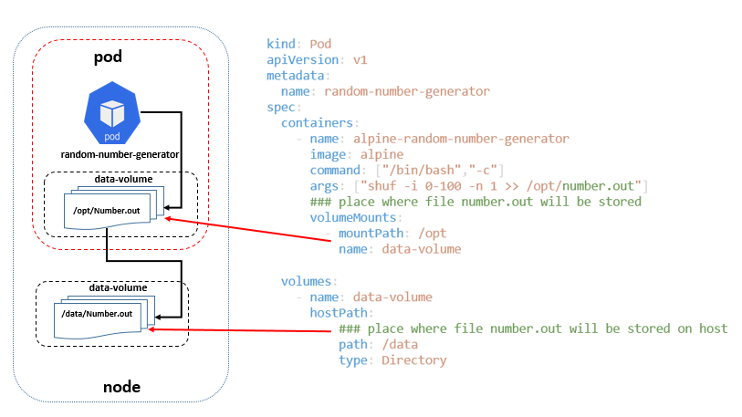
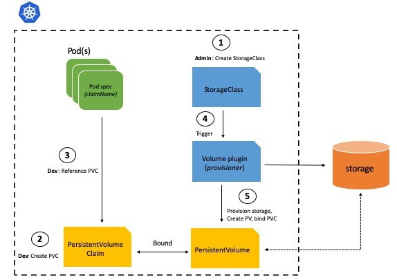

# Volumes

- On-disk files in a Container are ephemeral, which presents some problems for non-trivial applications when running in Containers. 
- First, when a Container crashes, kubelet will restart it, but the files will be lost - the Container starts with a clean state. Second, when running Containers together in a Pod it is often necessary to share files between those Containers. 
- The Kubernetes **Volume abstraction** solves both of these problems.

**Docker Volumes** 
- Docker also has a concept of volumes, though it is somewhat looser and less managed. In Docker, a volume is simply a directory on disk or in another Container. 
- Lifetimes are not managed and until very recently there were only local-disk-backed volumes.

**Kubernetes Volumes** 
- A Kubernetes volume, on the other hand, has an explicit lifetime - the same as the Pod that encloses it. 
- A volume outlives any Containers that run within the Pod, and data is preserved across Container restarts.
- when a Pod ceases to exist, the volume will cease to exist, too.
- Kubernetes supports many types of volumes, and a Pod can use any number of them simultaneously.

-  *A volume is just a directory, possibly with some data in it, which is accessible to the Containers in a Pod*


**Another way of categorizing Volumes**

- **Ephemeral** — Volumes which are tightly coupled with the Pod lifetime (e.g. emptyDir volume) i.e. they are deleted if the Pod is removed (for any reason).
- **Persistent** — Volumes which are meant for long term storage and independent of the Pod or the Node lifecycle. This could be NFS or cloud based storage in case of managed Kubernetes offerings such as Azure Kubernetes Service, Google Kubernetes Engine etc.

**Simple Volume Exmaple** 

- Here container generate a file "number.out" and on pod its stored under "/opt" and due to volume mount same is stored on node as "/data". 
- if container is destroyed for any reason, file generated by container wil be stil availale at /data over node. 



```
kind: Pod
apiVersion: v1 
metadata:
  name: random-number-generator
spec:
  containers:
    - name: alpine-random-number-generator
      image: alpine
      command: ["/bin/bash","-c"]
      args: ["shuf -i 0-100 -n 1 >> /opt/number.out"]
      ### place where file number.out will be stored
      volumeMounts:
        - mountPath: /opt
          name: data-volume 
      
  volumes:
    - name: data-volume
      hostPath:
          ### place where file number.out will be stored on host
          path: /data
          type: Directory
```

here **hostPath** is one of storage spec for volume and this is not recommanded for multi node cluster.

Kubernetes supports several types of Volumes:


There are different types of volumes you can use in a Kubernetes pod:

- Node-local memory (emptyDir and hostPath)
- Cloud volumes (e.g., awsElasticBlockStore, gcePersistentDisk, and azureDiskVolume)
- File-sharing volumes, such as Network File System (nfs)
- Distributed-file systems (e.g., cephfs, rbd, and glusterfs)
- Special volume types such as PersistentVolumeClaim, secret, and gitRepo

Here is the full list 

| awsElasticBlockStore | azureDisk          | gcePersistentDisk     | projected     |
|----------------------|--------------------|-----------------------|---------------|
| azureFile            | cephfs             | gitRepo (deprecated)  | rbd           |
| cinder               | configMap          | glusterfs             | secret        |
| csi                  | downwardAPI        | hostPath              | vsphereVolume |
| emptyDir             | fc (fibre channel) | local                 | storageos     |
| flexVolume           | flocker            | persistentVolumeClaim | scaleIO       |
| portworxVolume       | iscsi              | nfs                   | quobyte       |

# Persistent Volumes


- A PersistentVolume (PV) is a piece of storage in the cluster that has been provisioned by an administrator or dynamically provisioned using Storage Classes. 
- It is a resource in the cluster just like a node is a cluster resource. PVs are volume plugins like Volumes, but have a lifecycle independent of any individual Pod that uses the PV.
-  This API object captures the details of the implementation of the storage, be that NFS, iSCSI, or a cloud-provider-specific storage system.
- A PersistentVolumeClaim (PVC) is a request for storage by a user.


**A Kubernetes persistent volume has the following attributes**

- It is provisioned either dynamically or by an administrator
- Created with a particular filesystem
- Has a particular size
- Has identifying characteristics such as volume IDs and a name

In order for pods to start using these volumes, they need to be claimed (via a persistent volume claim) and the claim referenced in the spec for a pod. 

A Persistent Volume Claim describes the amount and characteristics of the storage required by the pod, finds any matching persistent volumes and claims these. Storage Classes describe default volume information (filesystem,size,block size etc).


**Create an Persistent Volume**

Sample PersistentVolume definition file. 
```
kind: PersistentVolume
apiVersion: v1 
metadata:
  name: Persistent-Volume
spec:
  capacity:
    storage: 1Gi
  accessModes:
    - ReadWriteOnce
  hostPath:
    path: /tmp/data    
```

**Note** : here hostPath is not an recommanded solution for production env. we should use the other recommanded solution like awsElasticBlockStore like below 

```
    awsElasticBlockStore:
      volumeID: <Volume-id>
      fsType: ext4

```

Now Lets create PersistentVolume , list it and describe it.

```
$ kubectl create -f persistent-vol.yaml
persistentvolume/pv-vol1 created

 $ kubectl get pvNAME      CAPACITY   ACCESS MODES   RECLAIM POLICY   STATUS      CLAIM   STORAGECLASS   REASON   AGE
pv-vol1   1Gi        RWO            Retain           Available                                   8s

$ kubectl get persistentvolume
NAME      CAPACITY   ACCESS MODES   RECLAIM POLICY   STATUS      CLAIM   STORAGECLASS   REASON   AGE
pv-vol1   1Gi        RWO            Retain           Available                                   11s

$ kubectl describe persistentvolume pv-vol1Name:            pv-vol1
Labels:          <none>
Annotations:     <none>
Finalizers:      [kubernetes.io/pv-protection]
StorageClass:
Status:          Available
Claim:
Reclaim Policy:  Retain
Access Modes:    RWO
VolumeMode:      Filesystem
Capacity:        1Gi
Node Affinity:   <none>
Message:
Source:
    Type:          HostPath (bare host directory volume)
    Path:          /tmp/data
    HostPathType:
Events:            <none>
```


**The Lifecycle of Persistent Volumes**
- Once you delete the PVC, you release the PV of its claim. 
- Depending on the reclaim policy set, the volume will either be retained, recycled, or deleted.
    - If you set the reclaim policy to retain, the volume in the storage remains even once released from the claim.
    - Alternatively, you can recycle the volume, which deletes the content inside of it and makes it available for other PVCs.
    - Having the reclaim policy configured to delete once it is disconnected from the PVC means that the volume and storage are removed completely.


**A PV goes through the following lifecycle phases, which are visible to other entities in the cluster:**      

- **Available** free for use, binding has not occured yet      
- **Bound** the PV was matched to a PersistentVolumeClaim and binding has occurred      
- **Released** the user deleted their PVC, but the PV is not yet reclaimed by the cluster●      
- **Failed** the PV could not be reclaimed by the cluster automatically


**Persistent Volumes Access Modes** 	
A PV can have the following access modes:      
- **ReadWriteOnce** —enables read and write and can be mounted by only one node      
- **ReadOnlyMany**  —enables read only and can be mounted by multiple nodes (but not at the same time)     
- **ReadWriteMany** —both read and write, can be mounted by several nodes (not at the same time)

# Persistent Volumes Claim 

After Creation of Persistent Volumes the next step is to create Persistent Volumes Claim. 

Every Persistent Volumes Claim is bind to a single Persistent Volumes.  

Claims will remain unbound indefinitely if a matching volume does not exist. Claims will be bound as matching volumes become available. 
    For example, a cluster provisioned with many 50Gi PVs would not match a PVC requesting 100Gi. The PVC can be bound when a 100Gi PV is added to the cluster.

After you create the PersistentVolumeClaim, the Kubernetes control plane looks for a PersistentVolume that satisfies the claim's requirements. 

If the control plane finds a suitable PersistentVolume with the same StorageClass, it binds the claim to the volume.


**Create Persistent Volumes Claim** 


List out the Persistent Volumes 

```
$ kubectl get pv
NAME      CAPACITY   ACCESS MODES   RECLAIM POLICY   STATUS      CLAIM   STORAGECLASS   REASON   AGE
pv-vol1   1Gi        RWO            Retain           Available                                   11m
pv-vol2   3Gi        RWO            Retain           Available                                   8s
```

Here we have 2 Persistent Volumes 1 with 1Gi Capacity and other with 3Gi Capacity. 

Now lets create a Persistent Volumes Claim

Sample PersistentVolumeClaim.

```
kind: PersistentVolumeClaim
apiVersion: v1 
metadata:
  name: pv-vol-claim-500mi
spec:
  accessModes:
    - ReadWriteOnce
  resources:
    requests:
      storage: 500Mi
```

here we are requestig for a volume with 500Mi storage and ReadWriteOnce accessModes mode.  

```
$ kubectl create -f persistent-vol-claim.yaml
persistentvolumeclaim/pv-vol-claim-500mi created

$ kubectl get pv
NAME      CAPACITY   ACCESS MODES   RECLAIM POLICY   STATUS      CLAIM                        STORAGECLASS   REASON   AGE
pv-vol1   1Gi        RWO            Retain           Bound       default/pv-vol-claim-500mi                           16m
pv-vol2   3Gi        RWO            Retain           Available                                                        4m48s
```

As soon as we create a persitent volume claim and do get pv command. it shows that out of 2 persistent-vol , one of them pv-vol1 got associated with the claim. 

- As we were looking for  a volume with 500Mi storage and ReadWriteOnce accessModes mode the pv-vol1 found it more suitable. 
- Now not other volume claim can me associated with  PersistentVolume Pv-vol1.

Now lets create 2 more PVC (Persisten Volume Claim) and list the PV (Persistent Volume)

```
$ kubectl get pvc
NAME                 STATUS    VOLUME    CAPACITY   ACCESS MODES   STORAGECLASS   AGE
pv-vol-claim-500mi   Bound     pv-vol1   1Gi        RWO                           6m42s
pv-vol-claim-600mi   Bound     pv-vol2   3Gi        RWO                           35s
pv-vol-claim-700mi   Pending                                                      8s

$ kubectl get pv
NAME      CAPACITY   ACCESS MODES   RECLAIM POLICY   STATUS   CLAIM                        STORAGECLASS   REASON   AGE
pv-vol1   1Gi        RWO            Retain           Bound    default/pv-vol-claim-500mi                           23m
pv-vol2   3Gi        RWO            Retain           Bound    default/pv-vol-claim-600mi                           11m
```

- Here we can see the 2 PVC got claim on 2 volumes and 3rd PVC status is in Pending status. 
- Now if we create a new PV with required storage and access mode , 3rd PVC will be bound to the new PV


Once you create a PVC use it in a POD definition file by specifying the PVC Claim name under persistentVolumeClaim section in the volumes section like this:

```
apiVersion: v1
kind: Pod
metadata:
  name: mypod
spec:
  containers:
    - name: myfrontend
      image: nginx
      volumeMounts:
      - mountPath: "/var/www/html"
        name: mypd
  volumes:
    - name: mypd
      persistentVolumeClaim:
        claimName: myclaim
```

The same is true for ReplicaSets or Deployments. Add this to the pod template section of a Deployment on ReplicaSet.

**Deletetion Of PV or PVC**
when a pod is using the PVC and PV is claimed by PVC
- if you try to delete PVC , it won;t delete. As PVC is associated with PV and PVC goes to terminating status. 
  - here if you delete the pod, PVC will be moved from terminating to Deleted status.   
- if you try to delete PV , it won;t delete. As PV is associated with PVC and PV goes to terminating status. 
  - here if you delete the pod, PV will be stil in terminating.
  - and here if you finally delete the PVC , PV will be also moved from terminating to deleted status.    


# StorageClass

PV Static Provisioning - we need to first allocate the disk or create storage before creating the PV.
PV Dynamic Provisioning - in order to create disk or storage dynamically storage classes are used. 




- The StorageClass object allows cluster administrators to define PVs with different properties, like performance, size or access parameters. 
- It lets you expose persistent storage to users while abstracting the details of storage implementation. 
- There are many predefined StorageClasses in Kubernetes , or you can create your own.
- Administrators can define several StorageClasses that give users multiple options for performance. 
  - For example, one can be on a fast SSD drive but with limited capacity, and one on a slower storage service which provides high capacity.

  In an nutshell , StorageClass allows you to create disk storage and PV both. you just need to create PVC and associate that with Pod.  

Storage class example
 
 ```
 kind: StorageClass
 apiVersion: storage.k8s.io/v1
 metadata:
  name : google-storage
 provisioner: kubernetes.io/gce-pd
 ```

 PVC with storage class
 ```
 kind: PersistentVolumeClaim
apiVersion: v1 
metadata:
  name: pv-vol-claim-500mi
spec:
  accessModes:
    - ReadWriteOnce
    
  resources:
    requests:
      storage: 500Mi
  storageClassName: google-storage # this storage class name comes from storage class definition. 
 ``` 